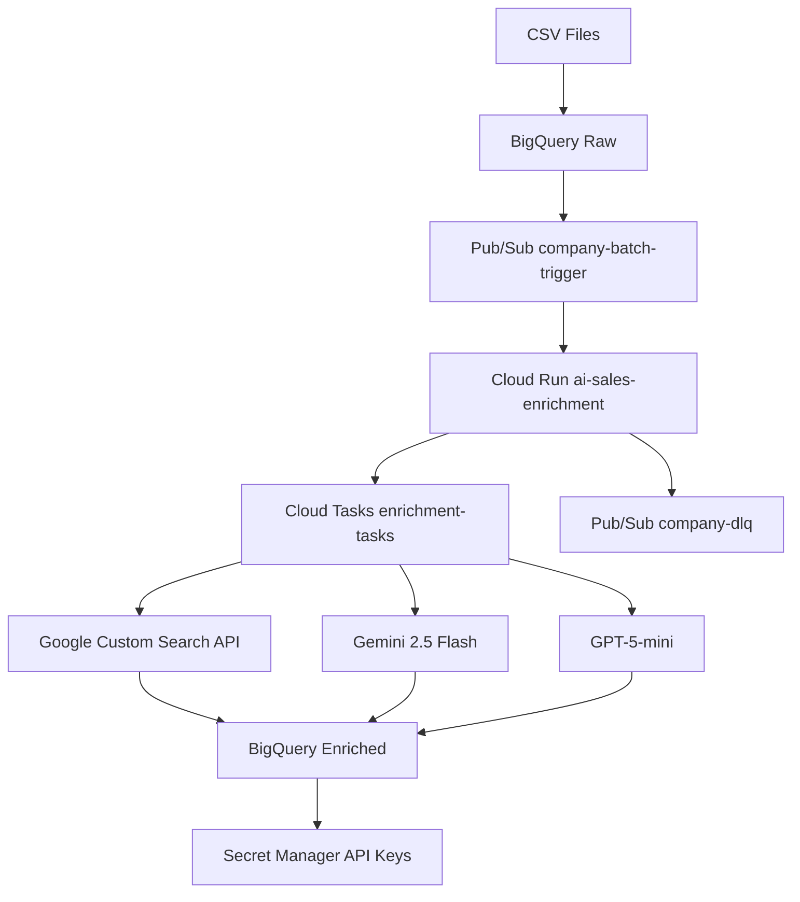

# 🏗️ GCP Architecture Overview

## 📊 **プロジェクト情報**
- **プロジェクトID**: `ai-sales-list`
- **プロジェクト番号**: `905635292309`
- **リージョン**: `asia-northeast1` (東京)

---

## 🚀 **Cloud Run サービス**

### 1. **ai-sales-enrichment** (メインサービス)
- **URL**: https://ai-sales-enrichment-905635292309.asia-northeast1.run.app
- **最終デプロイ**: 2025-10-18T12:29:38Z
- **リソース**:
  - **CPU**: 2 vCPU
  - **メモリ**: 2 GiB
  - **同時実行数**: 10
  - **タイムアウト**: 3600秒 (1時間)
- **役割**: 企業データエンリッチメントのメイン処理

### 2. **sales-enrichment-worker** (レガシーサービス)
- **URL**: https://sales-enrichment-worker-905635292309.asia-northeast1.run.app
- **最終デプロイ**: 2025-10-17T04:00:53Z
- **役割**: 旧バージョンのワーカーサービス（現在は非使用）

---

## 🗄️ **BigQuery データウェアハウス**

### **データセット**: `companies`

#### **テーブル構成**:

1. **`raw`** - 生データ
   - CSVファイルからアップロードされた元データ
   - 企業名、ウェブサイト、都道府県などの基本情報

2. **`enriched`** - エンリッチ済みデータ ⭐
   - **総行数**: 4,252行
   - **データサイズ**: 10.4 MB (論理) / 1.4 GB (物理)
   - **最終更新**: 2025-10-19 07:09:04

   **スキーマ**:
   ```sql
   website: string (required)
   name: string (required)
   name_legal: string
   industry: string (required)
   hq_address_raw: string
   prefecture_name: string
   overview_text: string
   services_text: string
   products_text: string
   pain_hypotheses: string (repeated)  -- 配列型
   personalization_notes: string
   employee_count: integer
   employee_count_source_url: string
   last_crawled_at: timestamp
   status: string
   signals: json
   ```

3. **`enriched_clean`** - クリーンアップ済みデータ
4. **`enriched_zp`** - 郵便番号処理済みデータ

---

## 🔄 **Cloud Tasks キュー**

### **enrichment-tasks**
- **状態**: RUNNING
- **最大タスク数**: 200
- **最大レート**: 50.0 req/sec
- **最大リトライ**: 5回
- **役割**: 個別企業処理タスクの管理

---

## 📡 **Pub/Sub メッセージング**

### **トピック**:
1. **`company-batch-trigger`**
   - バッチ処理のトリガー用
   - 複数企業の一括処理開始

2. **`company-dlq`** (Dead Letter Queue)
   - 処理失敗したメッセージの保存
   - エラー分析と手動処理用

---

## 🔐 **Secret Manager**

### **保存されているAPIキー**:
1. **`gemini-api-key`** (2025-10-17作成)
2. **`google-custom-search-api-key`** (2025-10-17作成)
3. **`google-custom-search-cse-id`** (2025-10-17作成)
4. **`openai-api-key`** (2025-10-16作成)
5. **`pplx-api-key`** (2025-10-16作成) - レガシー

---

## 🐳 **Artifact Registry**

### **リポジトリ**:
1. **`ai-sales-enrichment`** (0 MB)
   - AI Sales Enrichment用コンテナイメージ

2. **`cloud-run-source-deploy`** (3.8 GB) ⭐
   - Cloud Run Source Deployments
   - 実際のデプロイ済みイメージ

3. **`sales-enrichment`** (1.7 GB)
   - レガシーDockerリポジトリ

---

## 👤 **IAM サービスアカウント**

### **アカウント**:
1. **`sales-enrichment-worker@ai-sales-list.iam.gserviceaccount.com`**
   - AI Sales List Enrichment Worker
   - Cloud Run実行用

2. **`905635292309-compute@developer.gserviceaccount.com`**
   - Default compute service account
   - デフォルトサービスアカウント

---

## 🔄 **データフロー**



---

## 📊 **リソース使用状況**

### **BigQuery**:
- **データセット**: 1個 (`companies`)
- **テーブル**: 4個
- **総データ量**: 1.4 GB (物理)
- **処理済み企業**: 4,252社

### **Cloud Run**:
- **アクティブサービス**: 1個
- **レガシーサービス**: 1個
- **総メモリ**: 2 GiB
- **総CPU**: 2 vCPU

### **Artifact Registry**:
- **総ストレージ**: 5.5 GB
- **リポジトリ**: 3個

---

## 🔧 **設定とアクセス**

### **エンドポイント**:
- **メインAPI**: https://ai-sales-enrichment-905635292309.asia-northeast1.run.app
- **利用可能なエンドポイント**:
  - `/fast-process` - 高速処理
  - `/process-generic-addresses` - GENERIC住所処理
  - `/search-address` - 住所検索
  - `/generate-smart-addresses` - スマート住所生成
  - `/stats` - 統計情報

### **認証**:
- **サービスアカウント**: sales-enrichment-worker
- **権限**: BigQuery, Secret Manager, Cloud Tasks, Vertex AI

---

## 💰 **推定コスト**

### **月額コスト** (概算):
- **Cloud Run**: ~$50-100 (実行時間ベース)
- **BigQuery**: ~$20-50 (クエリ・ストレージベース)
- **Cloud Tasks**: ~$5-10 (タスク数ベース)
- **Pub/Sub**: ~$5-10 (メッセージ数ベース)
- **Secret Manager**: ~$1-2 (シークレット数ベース)
- **Artifact Registry**: ~$10-20 (ストレージベース)

**総計**: ~$90-190/月

---

## 🚨 **現在の課題**

1. **データ品質問題**: GENERIC住所が3,961社 (88%)
2. **処理ロジック混乱**: raw vs enriched テーブルの処理対象
3. **API認証エラー**: Gemini API 401エラー
4. **レガシーサービス**: sales-enrichment-worker が残存

---

## 📈 **スケーラビリティ**

### **現在の制限**:
- **Cloud Run**: 最大10同時実行
- **Cloud Tasks**: 最大200タスク
- **BigQuery**: ペタバイトスケール対応

### **スケールアップ可能**:
- **Cloud Run**: 0-100インスタンス自動スケール
- **Cloud Tasks**: 100M+タスク処理可能
- **BigQuery**: 無制限データ処理

---

*最終更新: 2025-10-18*
*調査者: AI Assistant*
